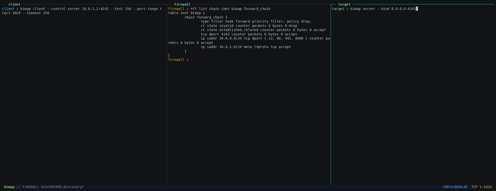

# Bimap — test traffic through middleboxes

Bimap tests what traffic can cross between two machines. Run it at both ends of
a network path to probe TCP and UDP ports, check payload delivery, and initiate
tests in either direction.

The cooperating endpoint supplies a responder on each tested port. You can
therefore test a firewall policy without deploying an application on every port.
The longer-term goal is to characterize policy and detect how middleboxes alter
traffic; see the [roadmap](ROADMAP.MD).

## First scan

Build on each machine with a Rust toolchain:

```sh
cargo build --release
```

On the remote machine, start the server:

```sh
./target/release/bimap server --bind 0.0.0.0:10443
```

On the local machine, replace `192.0.2.2` with the remote machine's IP:

```sh
./target/release/bimap client --control-server 192.0.2.2:10443 \
  --test 1kb --port-range tcp/10000-10010 --port-range udp/10000-10010
```

This checks a 1 KB round trip on each selected port. Those ports must be free
for Bimap to bind; the example uses ports above 1024 to avoid requiring root.

The client must first reach the server over a separate TLS control connection.
Allow TCP 10443 for this example and keep the control port outside the tested
range. The control connection coordinates tests and carries results.
Run the same build at both ends.

The server prints a certificate fingerprint at startup. Use
`--fingerprint <hash>` on the client to pin it; without a pin, the client
automatically accepts the server certificate. The fingerprint changes when the
server restarts.

## Test both directions

Add `--bidir` to run the same tests with the server initiating traffic:

```sh
./target/release/bimap client --control-server 192.0.2.2:10443 \
  --test 1kb --port-range tcp/10000-10010 --bidir
```

Replies to a forward connection do not establish that a new reverse connection
is allowed. Reverse probes must reach the client's address as seen by the server;
NAT and local firewalls can affect the result.

## Choose a test

| Test | Transport | What it checks |
|---|---|---|
| `open` | TCP, UDP | A one-byte round trip |
| `1kb` | TCP, UDP | A 1 KB round trip with payload integrity checks |
| `icmp-ping` | ICMP | An echo request/reply |
| `icmp-full` | ICMP | Responses to a sweep of ICMP types |
| `tls` | TCP | TLS handshake and 1 KB exchange; experimental |
| `dns` | TCP, UDP | DNS query/response exchange; experimental |

ICMP tests support IPv4 only. `icmp-ping` requires an installed `ping`
command compatible with Linux's `-c`, `-n`, and `-W` options and permission
to use it. `icmp-full` requires root or `CAP_NET_RAW`; unanswered types
produce a failed sweep. ICMP tests need no port range.

Use `client --help` and `server --help` for all options.

## Read the results

- **PASS**: the selected exchange succeeded.
- **FAIL**: the exchange failed, for example through timeout, refusal, or
  payload mismatch.
- **ERR**: Bimap could not run the test, for example because a port was occupied
  or permission was denied.

At the end of a human-readable scan, Bimap groups successful tests into
candidate allow rules by protocol, transport, port, and direction. These describe
only the tested paths; they are not a reconstruction of the middlebox's
configuration. Failed exchanges remain inconclusive: a timeout alone does not
prove filtering or identify where traffic stopped.

Payload-integrity tests report observed payload differences separately. This
confirms that the received data differed from the expected data, but does not
identify which device changed it or why. Other protocol transformations are
planned; see the [roadmap](ROADMAP.MD).

For scripts, use `--json` for one JSON result per line, or `--json-export`
for a single report with counts, candidate allow rules, observed payload
differences, and per-test results:

```sh
./target/release/bimap client --control-server 192.0.2.2:10443 \
  --test 1kb --port-range tcp/10000-10010 --json
```

Exit codes: **0** all passed; **1** test failures or errors; **2** invalid
configuration; **3** control connection failure. `-q` hides passing results
in human-readable output.

## Try the firewall lab



The [demo guide](labs/clab/README.md) runs a client and target across an nftables
firewall. Watch the [recording](labs/clab/demo.cast) or [video](labs/clab/demo.mp4).

For contributor guidance, see [AGENTS.md](AGENTS.md).
